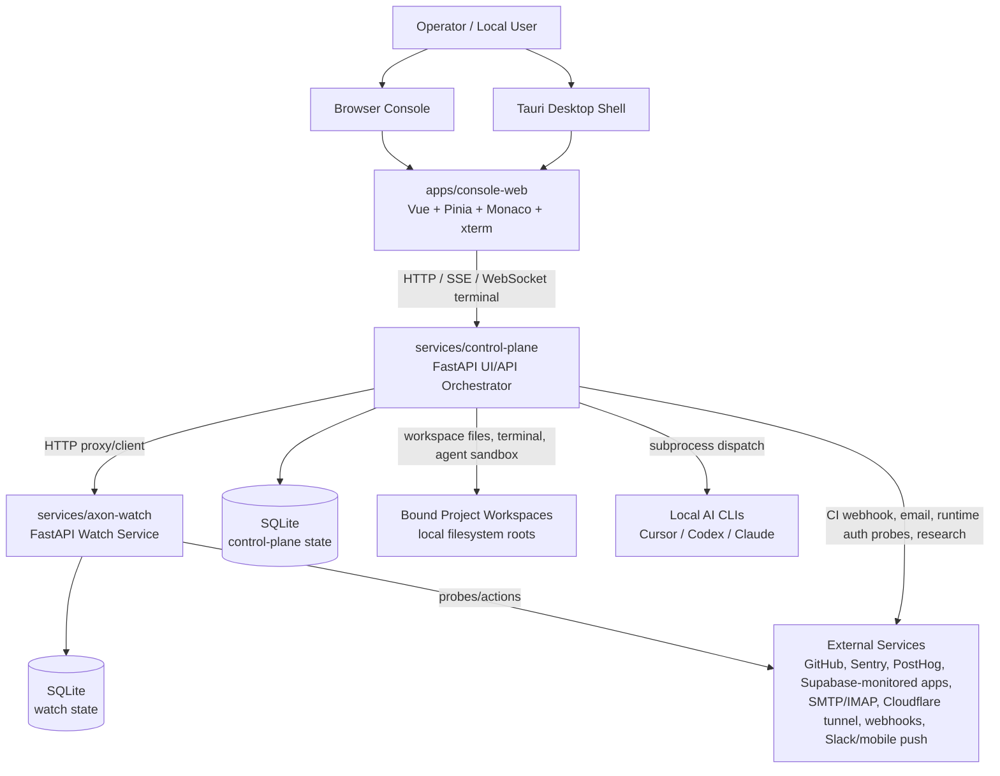
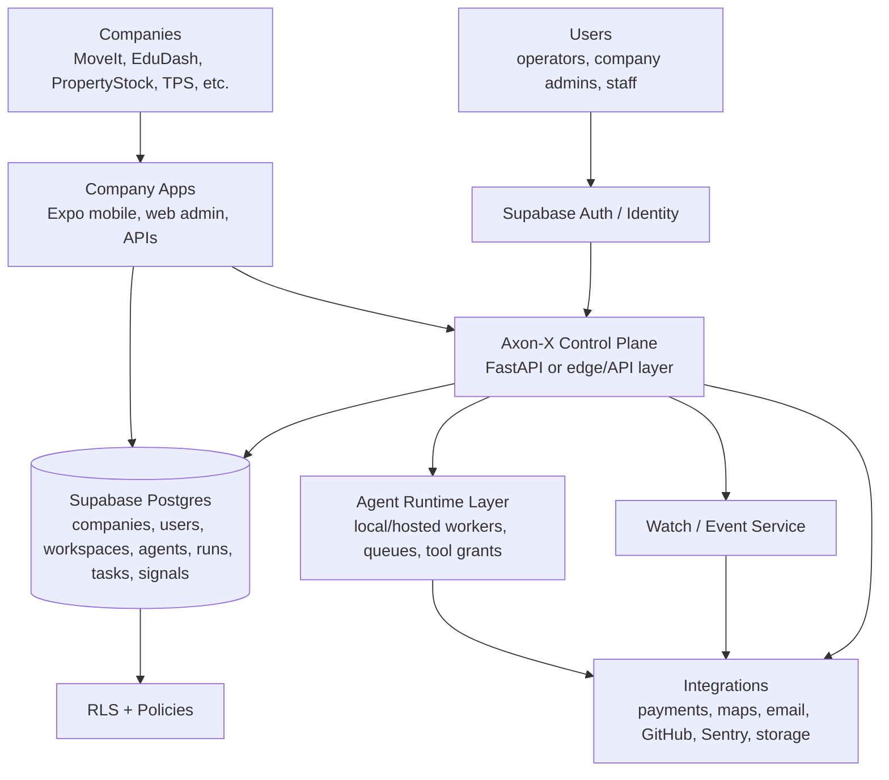

# AXON-X Platform Audit

Date: 2026-08-23  
Scope: existing `axon-watch` repository, branded in product/docs as Axon-X / Axon Ops Control.  
Method: static inspection of docs, manifests, service route registration, persistence code, checked-in config, shared contracts, frontend structure, infrastructure artifacts, and existing local SQLite schema. Secrets and token values were not inspected or reproduced.

## Executive Summary

Axon-X is currently a local-first operator control plane and AI-assisted coding/operations console. It combines a Vue IDE/operator shell, a FastAPI control plane, a FastAPI watch service, shared TypeScript DTO contracts, local SQLite persistence, a vault, runtime adapters for local CLI agents, signal/inbox monitoring, task/run state, workspace rosters, and deployment scaffolding.

It appears designed to become a central orchestration layer for multiple project workspaces and staffed AI teams. The repository already contains the beginnings of company/workspace rosters, cross-workspace missions, worker scheduling, task leasing, run history, evidence/decision/mission registries, watch signals, delivery receipts, and operator-facing recovery.

What is working:

- Three-surface local architecture: `apps/console-web`, `services/control-plane`, `services/axon-watch`.
- Vue/Pinia console with operator mode, IDE mode, Monaco/xterm surfaces, Kairo voice/presence, vault/data/settings/skills surfaces, and agent dock.
- FastAPI control-plane APIs for runs, chat, workspaces, agents, tasks, missions, vault proxying, runtime status, operator briefing, recovery, host context, email settings, and worker scheduling.
- FastAPI watch APIs for health, summary, connectors, inbox, monitors, delivery receipts, watch commands/events, tunnel control, Sentry actions, vault, and data snapshots.
- SQLite-backed run state, chat state, tasks, handoffs, memories, host context, lead plans, autonomy receipts, research cache, watch events, watch commands, delivery receipts, and signal acknowledgements.
- Workspace-bound "company" rosters through `config/workspace-agents.json`.
- Project binding and allowlist logic through `config/workspace-project-bindings.json` and `workspace_project_bindings.py`.
- AI runtime adapters for Cursor, Codex, Claude, and local non-Cursor dispatch, with sandbox/isolation policies for worker runs.
- Verification harness across shared types, route contracts, console tests, parity tests, and operational smoke scripts.

What is partially implemented:

- Multi-company orchestration exists as workspace-scoped rosters and projects, not as a true tenant/company data model.
- Worker autonomy has task leasing, run dispatch, isolation, recovery receipts, and policy gates, but still depends heavily on local CLI runtimes, file-system workspaces, and operator containment.
- Cross-workspace missions exist, but they are workspace impact workflows, not a generalized company portfolio engine.
- Auth has local operator-token/session containment and internal watch service tokens, but not Supabase Auth, users, roles, memberships, or row-level security.
- Infrastructure includes dedicated-server, Caddy, systemd, and reference Docker Compose artifacts, but no production cloud deployment, backups, managed secrets, hosted Postgres, or CI/CD deployment pipeline is established in this repo.
- Mobile is represented by a Vue mobile/compact shell; Expo / React Native is not implemented here.
- Supabase alignment exists mainly in stated direction and some monitor names. The checked-in `supabase/` directory is empty and there are no Supabase migrations.

What is missing:

- First-class `companies`, `tenants`, `users`, `memberships`, `roles`, `permissions`, and `service_accounts` tables.
- PostgreSQL/Supabase schema, migrations, RLS policies, storage buckets, and seed data.
- Clean isolation boundaries for independent companies such as MoveIt, EduDash, PropertyStock, TPS, School Transport, Educare, and Edusite Pro.
- Production identity provider integration.
- MoveIt domain entities: customers, drivers, fleet owners, vehicles, transport jobs, dispatch, live tracking, payments, ratings, proof of delivery.
- A production API gateway contract for company applications.
- Cloud hosting, backup, observability, and secrets-management baseline.

Maturity assessment: Axon-X is beyond a prototype as a local operator/AI control system, but it is not yet a production multi-company SaaS platform. Current maturity is best described as "local-first orchestration platform, advanced alpha / internal beta." Its agent/run/watch capabilities are materially implemented; its multi-tenant product-platform foundations are early.

Most important findings:

1. Axon-X already has a real orchestration core around runs, tasks, workspace rosters, worker scheduling, missions, signals, receipts, and recovery.
2. The current isolation unit is `workspace_id`, not `company_id` or tenant.
3. The current database is SQLite with code-owned schema creation, not Supabase/PostgreSQL migrations.
4. Authentication is local operator auth, desktop sessions, and internal service tokens, not multi-user identity.
5. The frontend is a substantial Vue IDE/operator console, not an Expo/React Native app.
6. Watch/control-plane separation is strong and should be preserved.
7. AI agents are functional through local CLI adapters and worker scheduling, but they are not independent SaaS agents with tenant-aware permissions.
8. The platform is more prepared to orchestrate software/project workspaces than to operate a logistics company like MoveIt.
9. There is significant maintainability risk from very large modules, many incremental SQLite migrations embedded in code, and broad local process/file privileges.
10. The best next architectural move is not a rewrite; it is to introduce a Supabase/PostgreSQL company/user/tenant spine and adapt existing workspace/run/task/signal models onto it.

## Repository Structure

### Main Applications

- `apps/console-web/`: primary Vue 3 + Vite + Pinia web console. It contains the operator shell, IDE shell, Monaco editor host, xterm terminal host, agent dock, mission control, Kairo voice/presence surfaces, vault/data/settings/skills pages, API clients, stores, components, tests, styles, and built `dist/` artifacts.
- `apps/console-desktop/`: Tauri desktop packaging wrapper for the console. It has Tauri config, Rust scaffold, packaging metadata, and desktop documentation.

### Backend Services

- `services/control-plane/`: FastAPI backend for UI-facing aggregation and action. It owns run state, chat, agent dispatch, workspace catalog, workspace files/terminal sessions, tasks, handoffs, missions, operator briefing, runtime status, vault proxy routes, auth middleware, recovery, host context, worker scheduling, and local agent runtime orchestration.
- `services/axon-watch/`: FastAPI watch service for monitoring, signal production, delivery receipts, watch commands/events, connector probes, monitor probes, Sentry attendance/resolve, tunnel control, vault operations, and internal data snapshots.

### APIs

Control-plane routes are centrally registered in `services/control-plane/app/routes/__init__.py`. Major route families include:

- `/api/health`, `/api/readiness`
- `/api/runtime/*`
- `/api/runs/*`
- `/api/chat/*`
- `/api/workspaces/*`
- `/api/tasks/*`
- `/api/workspace-missions/*`
- `/api/briefing`, `/api/operator/*`, `/api/operator-presence/*`, `/api/kairo/*`
- `/api/inbox`, `/api/connectors`, `/api/monitors`, `/api/watch/*`, `/api/delivery/receipts`
- `/api/vault/*`
- `/api/email/*`
- `/api/recovery/*`, `/api/platform/*`
- `/api/host/*`
- `/api/skills`
- `/api/webhooks/github/workflow-run`

Watch routes are defined directly in `services/axon-watch/app/main.py` under `/internal/watch/*`.

### Database

- Current database technology: SQLite.
- Main control-plane DB default: `./.local/state/control-plane.sqlite3`.
- Main watch DB default: `./.local/state/axon-watch.sqlite3`.
- Additional local DB files exist for CI remediation, fleet self-heal, recovery, workspace delivery, and historical/pre-stream states.
- Schema is created and evolved by Python store modules, not by a migration system.
- The `supabase/` directory exists but is empty.

### Authentication

- Control plane: `app.auth` middleware, local operator bearer token mode, desktop session cookie/header, loopback bypass for local development, origin guard, and rate limiting.
- Watch: internal service token middleware and optional proxy-verified mTLS checks for mutating/confidential internal routes.
- There is no Supabase Auth integration and no multi-user membership model.

### AI / Agent Components

- `services/control-plane/app/cli_runtime/`: local runtime catalog, Cursor/Codex/Claude adapters, model selection, subprocess registry, sandbox policies, auth probes, MCP registry, research MCP integration, stream normalization, recovery, and dispatch routing.
- `services/control-plane/app/workspace_agents/`: company/employee roster logic, worker scheduler, worker dispatch, lead planning, handoffs, routing, autonomy scans, verifier contracts, delivery, isolation, execution policy, task scope, and many specialist helper modules.
- `services/control-plane/app/kairo*` and `app/kairo/`: operator conversation, voice, memory, smalltalk, command/intent handling, attachments, deterministic reports, and teammate handoff support.

### Shared Libraries

- `packages/shared-types/`: TypeScript contracts for runs, runtime summary, signals, delivery receipts, watch summary, briefing, presence, host context, workspace agents, and missions.
- `packages/shared-types/fixtures/`: example DTO payloads used as contract fixtures.

### Configuration

- `.env.example`: local ports, service URLs, SQLite paths, auth modes, worker scheduler settings, delivery adapters, speech, connector probes, vault/tunnel settings, and research settings.
- `config/workspace-agents.json`: workspace-scoped company rosters and employee roles.
- `config/workspace-project-bindings.json`: workspace-to-project-root bindings.
- `config/watch-connectors.json`: watch connector probes.
- `config/deployment-topology.json`, `config/deployment.env.example`: dedicated deployment posture.
- Additional config covers delivery channels, CI remediation, tunnel, operator production, parity, research, voice, browser startup, and project contracts.

### Scripts

- `scripts/dev/`: local stack bootstrap, health checks, Python wrapper, evidence collection.
- `scripts/verify/`: broad verification suite and parity tests.
- `scripts/ops/`: service launchers, platform doctor, deployment validation, tunnel cutover, monitor polling, recovery helpers, wrappers, and operational commands.
- `scripts/guardrails/`: CSS import order, file-size, DTO-size, and hotspot checks.
- `scripts/desktop/`: desktop packaging and verification.
- `bin/`: installed convenience wrappers for selected ops scripts.

### Tests

- `tests/`: large Python test suite for control-plane, watch, agents, tasks, autonomy, auth, delivery, recovery, Kairo, runtime adapters, console-related behavior, and parity.
- `apps/console-web/src/**/*.test.ts`: frontend unit tests.
- Package scripts expose `verify:shared-types`, `verify:contracts`, `verify:console-web`, `verify`, and many specific parity/test scripts.

### Deployment / Infrastructure

- `infra/systemd/`: service units for console, control plane, and watch.
- `infra/caddy/`: public reverse proxy example exposing the control plane and static UI while keeping watch internal.
- `infra/docker-compose.dedicated.yml`: reference dedicated-server compose topology.
- No cloud provider IaC, Supabase deployment config, hosted secrets manager config, backup schedule, or production CI/CD pipeline is present.

### Documentation

Important current docs:

- `README.md`, `PRODUCT.md`, `ARCHITECTURE.md`
- `docs/DEDICATED_SERVER_READINESS.md`
- `docs/WATCH_CONNECTORS.md`
- `docs/DELIVERY_RECEIPTS.md`
- `docs/WORKSPACE_CATALOG.md`
- `docs/OPERATOR_MISSION_CONTROL_V1.md`
- `docs/AXON-X-AUTONOMY-READINESS.md`
- `docs/PHASE_G5_CAPABILITY_MATRIX.md`
- `docs/adr/*`
- `docs/planning/*`

## Current Architecture

### Architecture Pattern

The implemented pattern is a local-first control-plane/watch split:

- Watch detects and persists.
- Control plane decides and acts.
- UI presents and steers.

This matches `ARCHITECTURE.md` and is materially reflected in route ownership.

### Major Components

- Console: operator/IDE UI, API clients, state, live events, voice, terminal/editor shell.
- Control plane: orchestration API, runtime truth, agent dispatch, task ledger, workspace catalog, operator briefing, auth, recovery, host context.
- Watch: signal production, monitoring, connector probes, delivery receipts, vault, tunnel supervision, events stream.
- Shared contracts: TypeScript DTO baseline.
- Local storage: SQLite + local config JSON + project filesystem.
- External integrations: Sentry, PostHog, GitHub, Cloudflare tunnel, email, Azure speech, webhooks, Slack/mobile push adapters, local/remote research providers.

### Communication

- Console talks to control plane with HTTP JSON, SSE for live events, and WebSocket for workspace terminal sessions.
- Control plane talks to watch over HTTP through `watch_client`/`watch_http`.
- Watch exposes internal routes under `/internal/watch/*`.
- Control plane launches local CLI agents as subprocesses.
- Workspace file/editor/terminal operations resolve to configured local project roots.

### API Boundaries

Good boundaries already exist between:

- UI-facing control-plane API and internal watch API.
- Watch service monitoring/signal responsibility and control-plane action/orchestration responsibility.
- Runtime adapters under `cli_runtime`.
- Shared DTO contracts in `packages/shared-types`.

Weak or incomplete boundaries:

- Company/tenant/user identity is not a first-class boundary.
- Some large modules combine many UI or orchestration responsibilities.
- Store schema evolution is scattered across Python modules rather than centralized migrations.
- Local filesystem and subprocess permissions remain a major boundary risk.

### Data Flow

Typical operator flow:

1. Console checks `/api/auth/session`.
2. Console loads workspaces, runtime summary, runs, briefing, inbox, company rosters, and files.
3. Control plane aggregates local SQLite state plus watch snapshots.
4. Watch probes connectors/monitors and assembles inbox items/signals.
5. Operator starts/approves/resumes/dispatches work.
6. Control plane records runs/tasks/history and may launch a local AI CLI.
7. Worker or agent output is streamed/stored into chat/run history and terminal/job mirrors.
8. Watch delivery and events record attention receipts.

### Authentication Flow

Current flow:

- Local development defaults to placeholder/off auth and loopback bypass.
- Remote reachability forces local token mode when configured via public URL or `AXON_WATCH_REMOTELY_REACHABLE`.
- Mutating control-plane APIs use bearer/operator token, desktop session cookie/header, or loopback bypass when allowed.
- Desktop can mint/consume bootstrap codes and issue signed session tokens.
- Cross-origin mutating requests are blocked when remotely reachable and origin does not match expected public origin, except loopback console origins.
- Watch mutating/confidential internal routes use `X-Axon-Internal-Token` when configured/required and can require proxy-verified mTLS.

Missing:

- User accounts.
- Company memberships.
- Tenant-aware roles.
- Supabase JWT verification.
- RLS policies.
- Service-account permissions.

### AI / Agent Flow

Implemented flow:

- Workspace roster config defines company employees by role/schedule.
- Operator or scheduler creates/leases tasks.
- Runs represent state truth.
- Worker scheduler starts continuous/always-on employee runs when enabled and within concurrency limits.
- Worker dispatch creates isolation, resolves execution policy, builds a prompt, selects runtime target/model, then dispatches through Lane B / CLI runtime.
- CLI runtime can run Cursor, Codex, Claude, or local fallback paths and stream output back into thread/run surfaces.
- Receipts, run history, task terminal status, and recovery records track outcomes.

Missing:

- Tenant-scoped agent permissions.
- Cloud-native durable workflow engine.
- Agent-to-agent messaging bus independent of workspace chat/task stores.
- Production-grade job queue.

## Database & Data Model

### Technology

Current persistent storage is SQLite. The control-plane and watch services each own SQLite schemas. Some subsystems have separate SQLite files for focused operational stores.

There is no active PostgreSQL schema and no Supabase migrations.

### Main Control-Plane Tables Observed

From code and local DB schema:

- `runs`
- `run_history`
- `chat_threads`
- `chat_messages`
- `chat_attachments`
- `workspace_tasks`
- `workspace_handoffs`
- `workspace_composer_prefs`
- `operator_memories`
- `kairo_session_memory`
- `operator_presence_settings`
- `email_operator_settings`
- `worker_scheduler_settings`
- `host_devices`
- `host_snapshots`
- `host_events`
- `host_artifacts`
- `host_action_receipts`
- `host_policy`
- `autonomy_attention_receipts`
- `autonomy_attention_meta`
- `lead_plans`
- `lead_plan_tasks`
- `lead_plan_receipts`
- `lead_adhoc_receipts`
- `research_cache`

Additional code-defined registries/stores:

- `evidence_registry`
- `mission_registry`
- `decision_registry`
- `capability_registry`
- `adr_registry`
- `technical_debt_registry`
- `platform_health_registry`
- `workspace_missions`
- `workspace_mission_nodes`
- `workspace_deliveries`
- `ci_remediation_events`
- `ci_remediation_signals`
- `fleet_repair_events`
- `fleet_repair_signals`
- `recovery_records`
- `run_checkpoints`
- `circuit_breakers`
- `retry_fingerprints`
- `recovery_lessons`

### Main Watch Tables Observed

- `watch_commands`
- `watch_events`
- `watch_delivery_receipts`
- `watch_delivery_dedupe`
- `watch_signal_acknowledgements`
- `watch_sentry_issue_attendances`
- `vault_settings`
- `vault_secrets`

### Relationships

Relationships are mostly application-enforced:

- `workspace_id` appears across runs, chat, tasks, memories, handoffs, host artifacts, lead plans, missions, and company roster projection.
- `run_id` links runs to chat, tasks, receipts, and recovery.
- `task_id` links tasks to runs, lead plans, missions, decisions, and evidence.
- `history_ref` links runs to run history.
- `thread_id` links chat threads/messages/attachments.
- `mission_id` links workspace missions to mission nodes/tasks.

Foreign keys are sparse. Some tables define foreign keys, but many cross-entity relationships are text references with application-level enforcement.

### Authentication / User Tables

There are no users, profiles, memberships, organizations, roles, permissions, sessions, API keys, or service-account tables suitable for SaaS identity.

Auth settings are environment-driven plus in-process session signing. Desktop session tokens are not stored as rows.

### Tenant / Company Concepts

Current company concept:

- `config/workspace-agents.json` maps `workspace_id` to `company_name` and employees.
- `workspace_id` maps to local project roots via `config/workspace-project-bindings.json`.
- API routes expose `/api/workspaces/{workspace_id}/company`, `/api/company-roles`, `/api/agents`.

This is a roster/config concept, not a tenant data model. There is no durable `companies` table and no normalized company identity.

### Roles and Permissions

Implemented role concepts:

- Workspace agent roles: `lead`, `watcher`, `frontend`, `backend`, `integrations`, `workspace_agent`, `overview_agent`.
- Employee schedules: `always_on`, `continuous`, `on_demand`.
- Execution policies can restrict write paths, approved wrappers, network mode, and timeout for employee work.
- Operator auth controls HTTP mutation access globally.

Missing:

- Human user roles.
- Company memberships.
- Per-company permissions.
- Per-agent tool grants backed by database policy.
- RLS.

### Migrations and Seed Data

There is no migration framework. Schema creation and incremental `ALTER TABLE` changes are embedded in store modules such as `run_store_sqlite.py`, `task_store.py`, `workspace_mission_store.py`, and registry stores.

Seed/config data is JSON-based:

- Workspace/company rosters in `config/workspace-agents.json`.
- Workspace/project bindings in `config/workspace-project-bindings.json`.
- Connectors and service connections in `config/`.
- Fixture DTOs in `packages/shared-types/fixtures/`.

### Row-Level Security and Storage Buckets

Not implemented. SQLite has no RLS. Supabase storage buckets are not present.

### Can Current DB Support Axon-X -> Multiple Companies -> Isolated Company Data?

Not cleanly.

The current data model can represent multiple workspaces and assign each workspace a company-like roster. It can support an internal operator viewing multiple project workspaces. It cannot yet guarantee isolated company data for independent companies because:

- `workspace_id` is the isolation key, not `company_id`.
- No normalized company table exists.
- No human users or memberships exist.
- No RLS policies exist.
- No PostgreSQL schemas/databases exist.
- Some data is global settings keyed by a singleton key.
- External credentials live in a local vault model rather than company-scoped secrets storage.
- Config JSON is operator-maintained and local, not a controlled admin data model.

For MoveIt, EduDash, PropertyStock, TPS, School Transport, Educare, and Edusite Pro, the current architecture can model them as workspaces, but it cannot provide clean SaaS tenant isolation without a new company/tenant spine.

## Axon-X as an Orchestration Layer

This is the strongest part of the repository.

### Already Implemented

- Runs and run lifecycle: `runs`, `run_history`, run phases, stop/resume/approve/reject/review-ready/complete routes.
- Tasks: durable task ledger with leasing, dependencies, attempt budgets, owner roles, allowed/exclusive paths, completion/failure/cancel.
- Workspace rosters: configurable companies/employees per workspace.
- Worker scheduler: continuous/always-on roles, global concurrency bounds, max starts per tick, stale run reaping, missing task reconciliation.
- Agent dispatch: Cursor/Codex/Claude/local adapters, model/runtime selection, subprocess registry, streaming, usage/auth probes.
- Worker isolation and execution policy: isolation roots, write scope checks, approved wrappers, network mode, timeout receipts.
- Lead plans: persisted plans, task links, receipts, replans.
- Workspace handoffs: source/target workspace routing and receipts.
- Cross-workspace missions: source task, impact edges, affected nodes, verification/promotion lifecycle.
- Signals/inbox: watch-built inbox, connector signals, monitor signals, ranking, acknowledgement.
- Delivery receipts: inbox/desktop and optional webhook/mobile/slack adapters.
- Events: watch events and stream route.
- Operator briefing: runtime/watch/runs/signals/approvals summary.
- Recovery: recovery center, circuits, lessons, run resume, platform doctor/reconcile.
- Vault: setup/unlock/lock/secrets/import/export/provider keys/runtime env.
- Tunnel control: Cloudflare/native tunnel supervisor and start/stop/status.
- Host context: local desktop/browser host capability and action receipts.
- Email settings/reply/SMTP/IMAP projection.
- GitHub CI remediation webhook and reports.
- Local notifications and speech/TTS/STT support.

### Partially Implemented

- Company/tenant management: represented by workspace roster config, not database-managed companies.
- User management: operator session only; no real users.
- Permissions: execution policies and HTTP auth exist, but no tenant-aware RBAC.
- Workflow orchestration: run/task/mission history is durable, but no external durable workflow engine.
- Scheduling: local in-process scheduler, not distributed/queued cloud scheduler.
- Monitoring: connectors and selected monitors exist, but full observability stack is not present.
- Logging: Python logging and receipts/history exist, but no centralized log platform.
- API gateway: control-plane proxies/aggregates watch APIs, but no formal company API gateway.
- Integrations: many concrete adapters exist, but they are local/config-driven and not tenant-scoped.
- Automation: strong for project/code operations, early for business workflows.

### Not Implemented

- Multi-company tenant admin.
- Supabase/PostgreSQL schema and RLS.
- Production identity provider.
- Company app API surface for MoveIt-like apps.
- Payments, tracking, customer/driver management, business domain workflows.
- Cloud-native job queue/workflow engine.
- Centralized logs/metrics/traces.
- Managed secrets per company/environment.
- Backup/restore automation.

### Architecturally Implied but Not Yet Built

- Axon-X central orchestration layer across independent companies.
- Company-scoped agents with tenant permissions and tool grants.
- Workflow history that could later map to Temporal or another durable workflow system.
- Supabase-backed data plane.
- Expo/React Native mobile control plane.
- API gateway facade for company applications.

## AI Agent Architecture

### Agent Types

| Agent / Runtime | Purpose | Inputs | Outputs | Tools / APIs | DB Access | Trigger | State / Memory | Functional? |
|---|---|---|---|---|---|---|---|---|
| Cursor local runtime | Run agent/plan/ask/debug work against a workspace | Prompt, context block, workspace root, model, execution tier | Text/stream, tool blocks, file changes, generated image paths | Cursor CLI, optional research MCP, workspace filesystem | Indirect through control-plane run/chat stores | Operator composer or worker dispatch | Run history, chat messages, CLI auth/usage probes | Yes, adapter implemented |
| Codex local runtime | Run Codex CLI work | Prompt, workspace root, mode, model, reasoning effort | JSON-stream normalized text/tool/edit blocks | Codex CLI, sandbox settings | Indirect through control-plane stores | Operator composer or worker dispatch | Run history/chat | Yes, adapter implemented |
| Claude local runtime | Runtime candidate for agent dispatch | Prompt/model/env | Text/stream result | Claude CLI | Indirect | Operator/worker dispatch | Auth/usage probes | Implemented by files/tests; details less central than Cursor/Codex |
| Lane B agent | Main IDE composer/worker path | Workspace, composer mode, prompt, context, run id | Chat result, stream, receipts | Runtime router and CLI adapters | Uses run/chat stores | `/api/chat/messages`, worker dispatch | Thread context, turn memory, run history | Yes |
| Kairo / VAXON operator presence | Conversation, voice, briefing, smalltalk, intents, command acknowledgements | Operator speech/text, context packs, runtime context | Replies, TTS, transcripts, actions | Kairo routes, Azure speech, runtime dispatch for deeper work | Voice log, memories, settings, chat | `/api/kairo/*`, UI voice hooks | Session memory, participant/operator memory | Yes/partial depending on voice provider config |
| Workspace employee agents | Role-scoped AI teammates per workspace/company | Task, role, owns, schedule, execution policy | Runs, task outcomes, delivery pipeline receipts | Worker dispatch, CLI runtime, workspace filesystem | Task/run stores, lead plans, receipts | Scheduler, operator start, lead fan-out | Run history, task ledger, employee threads | Yes, local-first |
| Lead agent | Plans/decomposes/routes work | Goal, workspace roster, current tasks/context | Lead plan, tasks, handoffs, reports | Task APIs/stores, teammate routing, Lane B | Lead plan/task stores | Operator commands, lead routes, scheduled/on-demand | Lead plan receipts | Partially functional; many modules/tests |
| Watcher role | Monitors signals and runtime health | Watch inbox/connectors/monitors | Signals, advice, tasks/attention | Watch service APIs | Watch DB and control-plane projections | Always-on scheduler / watch loops | Receipts/signals | Partially implemented |
| CI remediation / fleet self-heal | Classify and dispatch repair from CI/fleet signals | Webhook/report events | Repair signals/reports/dispatch | GitHub webhook, fleet stores, worker dispatch | Separate SQLite stores | Webhooks/poll scripts | Events/signals | Partial |
| Safe improvement agent | Propose/evaluate/execute controlled improvements | Traces/cases/proposals | Proposal lifecycle | Sandboxed workspace evaluation | Safe improvement store | `/session`, `/proposals` routes | Proposal store | Partial; gated routes |
| Research MCP agent capability | Online research for runtime prompts | Search/fetch query | Research blocks/receipts | SearXNG, Google CSE fallback, DuckDuckGo fallback | Research cache | Runtime prompt when enabled | Cache/receipts | Partial; provider-dependent |

### Communication Between Agents

Agents do not communicate through a standalone message bus. Communication occurs through:

- Chat threads/messages.
- Task ledger ownership and dependencies.
- Lead plans and task links.
- Workspace handoffs.
- Mission nodes and impact edges.
- Run history receipts.
- Operator briefing and recovery surfaces.

### Memory / State

Implemented memory/state stores include:

- `kairo_session_memory`
- `operator_memories`
- `chat_threads` / `chat_messages`
- `runs` / `run_history`
- `workspace_tasks`
- `lead_plans`
- `autonomy_attention_receipts`
- recovery records/checkpoints

This is useful, but it is not a general vector memory, tenant memory, or long-term agent knowledge graph.

### Permissions

Current permissions are execution-policy and route-auth based:

- Read-only/consultative vs executing tiers.
- Sandbox policies.
- Allowed write paths and wrappers.
- Network mode and timeout.
- Operator token/session for mutating HTTP routes.

Missing:

- Tenant-aware tool grants.
- User/agent identity binding.
- Auditable per-company service accounts.

## Authentication, Users & Permissions

### Provider

Current provider is local Axon-X auth:

- `AXON_WATCH_AUTH_MODE`
- `AXON_WATCH_OPERATOR_TOKEN`
- signed desktop sessions
- optional loopback bypass
- origin guard and rate limit

There is no Supabase Auth, OAuth, SSO, or user database.

### Roles

Implemented roles are agent employee roles, not human user roles. Human operator access is effectively global once authenticated.

### Admin Access

Admin/operator authority is environment-token/session based. There is no admin panel backed by RBAC.

### Service Accounts / API Keys

- Watch internal token: `AXON_WATCH_INTERNAL_SERVICE_TOKEN`.
- Runtime/API provider keys are environment or vault-managed.
- GitHub/Sentry/email/Azure/search keys are referenced by env/vault config.
- No normalized service-account table exists.

### Session Management

Desktop session tokens are HMAC-signed tokens from a process secret/operator token fallback. Bootstrap codes are in-process with TTL. There is no persistent session table.

### Company / Tenant Boundaries

Not implemented. Workspace boundaries are application conventions and file/config scopes, not DB/security boundaries.

### Security Weaknesses / Risks

- Local bootstrap can run with auth off and loopback bypass; this is acceptable locally but dangerous if deployment reachability is misconfigured.
- Remote hardening depends on correct public URL/reachability env.
- No user/tenant-level authorization.
- SQLite state has no RLS.
- Local CLI agents can have broad filesystem/subprocess impact if execution policy is wrong.
- Vault auto-unlock is restricted for remote by default, but still needs careful deployment posture.
- Watch internal routes must not be exposed publicly; Caddy example follows this, but infra drift would be high risk.

## API & Integration Layer

### Important APIs

| Endpoint / Service | Purpose | Auth | Input / Output | Status | Dependencies |
|---|---|---|---|---|---|
| `/api/health`, `/api/readiness` | Service health/readiness | GET public/local | JSON health/readiness | Implemented | Control-plane process |
| `/api/runtime/summary`, `/api/runtime/status` | Runtime/watch/CLI readiness summary | GET | Runtime DTO | Implemented | Watch service, CLI probes |
| `/api/runs/*` | Run lifecycle | Mutating auth for writes | Run records/history/actions | Implemented | SQLite run store |
| `/api/chat/*` | Composer chat, streams, attachments | Mutating auth for writes | Threads/messages/SSE | Implemented | Chat store, runtime router |
| `/api/workspaces/*` | Workspace catalog, files, terminal, rosters, handoffs | Mutating auth for writes; WebSocket terminal | Records, file content, terminal sessions | Implemented | Project bindings, filesystem |
| `/api/tasks/*` | Durable task ledger | Mutating auth for writes | Task records/lease/complete/fail | Implemented | SQLite task store |
| `/api/workspace-missions/*` | Cross-workspace missions | Mutating auth for writes | Mission graph/lifecycle | Partial/implemented v1 | Task/handoff/delivery stores |
| `/api/agents`, `/api/workspaces/{id}/company` | Agent/company roster | GET | Roster/role DTOs | Implemented | JSON config, run state |
| `/api/briefing`, `/api/operator/*` | Operator summary, fleet, memory, autonomy, Kairo | Mixed | Briefing/status/memory/voice | Implemented/partial | Runs, watch, settings, speech |
| `/api/inbox`, `/api/connectors`, `/api/monitors` | Watch projections | GET/proxy mutations | Signals/probe records | Implemented | Watch HTTP client |
| `/api/watch/commands`, `/api/watch/events` | Watch commands and events | Mutating auth for commands | Command/event records | Implemented | Watch service |
| `/api/delivery/receipts` | Delivery trace | GET | Receipt snapshot | Implemented | Watch delivery store |
| `/api/vault/*` | Vault proxy | Sensitive GET/mutating auth | Secret metadata/secret values/export/import | Implemented | Watch vault |
| `/api/email/*` | Email settings, folders, messages, suggest/send | Mutating auth for writes | Settings/messages/suggestions | Partial/provider dependent | IMAP/SMTP/vault |
| `/api/webhooks/github/workflow-run` | CI remediation ingest | GitHub signature route exemption | Webhook payload | Partial | GitHub Actions |
| `/api/recovery/*`, `/api/platform/*` | Recovery center, doctor, circuits, lessons | Mutating auth for writes | Recovery/doctor records | Implemented | SQLite recovery/platform stores |
| `/internal/watch/*` | Watch internal API | Internal token/mTLS for mutating/confidential | Watch summaries/actions/vault | Implemented | Watch process |

### External Integrations

- GitHub Actions / webhook / CI remediation.
- Sentry monitor and issue resolve/attend.
- PostHog monitor.
- Supabase storage monitor for DashPro-like external apps.
- Cloudflare tunnel/native process.
- IMAP/SMTP email.
- Azure Speech TTS/STT.
- SearXNG / Google CSE / DuckDuckGo research.
- Webhook, mobile push, Slack, desktop delivery adapters.
- Cursor, Codex, Claude CLIs.
- MCP tools for runtime research/composer capability.

### API Gateway / Orchestration Foundation

Axon-X has the foundation of an orchestration facade for its own console: the control plane aggregates watch, runs, workspaces, agents, tasks, runtime, and vault. It is not yet an API gateway for independent company apps. There is no stable public company API namespace, tenant auth, rate limits per company, API keys, or OpenAPI-public contract.

## Frontend / Application Architecture

### Framework

- Vue 3.
- Vite.
- Pinia.
- TypeScript.
- Monaco editor.
- xterm.
- Three/TresJS for some visual surfaces.
- Tauri wrapper for desktop.

### Navigation and Shell

`App.vue` switches between:

- Console shell.
- Vault surface.
- Data surface.
- Skills surface.
- Operator mobile shell.
- Settings surface.
- Dev scan preview.

The primary console shell has locked regions:

- `TopBar`
- `LeftSidebar`
- `CenterWorkbench`
- `RightDock`
- `StatusBar`

### Auth Screens

`OperatorLoginGate.vue` is displayed when `/api/auth/session` reports unauthenticated or when a 401 event is emitted by API client helpers.

### Dashboard / Operator Surfaces

Implemented components include mission control, attention stack, fleet health, company roster, incident feed, live ops panels, recovery center, operator brain graph, task board, connectors rail, email inbox, and Kairo briefing/presence.

### State Management

Main state is in `stores/shell.ts` with supporting store modules. This store is large and central. Many composables extract behavior for agent dock, workspace files, terminal sessions, voice, resizing, and UI preferences.

### API Communication

API clients live in `apps/console-web/src/api/`. `client.ts` centralizes fetch timeout handling, same-origin credential inclusion, API base URL, auth-required events, JSON/blob helpers, and transient error classification.

### Reusable UI Architecture

Reusable across future companies:

- Workspace picker/catalog.
- Company roster panel.
- Agent dock and composer.
- Runtime policy controls.
- Task board.
- Mission control.
- Watch/inbox/connector panels.
- Vault and data export surfaces.
- Recovery center.

Not directly reusable as a mobile app:

- Vue shell is browser/desktop-centric.
- Monaco/xterm surfaces are web IDE concepts.
- Expo/React Native would need separate UI implementation consuming shared API contracts.

### Alignment With Intended Stack

Intended mobile: Expo / React Native. Current repo: Vue web/Tauri, plus responsive/mobile operator shell. Alignment is low at implementation level, moderate at API-contract level.

Intended backend: Supabase/PostgreSQL. Current repo: FastAPI + SQLite. Alignment is low at persistence implementation level, but the existing `workspace_id`-scoped DTOs can inform a PostgreSQL schema.

## Infrastructure & Deployment

### Current Hosting

Local development defaults:

- Console web: `127.0.0.1:4173`
- Control plane: `127.0.0.1:8787`
- Watch service: `127.0.0.1:8788`

Dedicated-server reference:

- Systemd service units.
- Caddy reverse proxy serving static console and proxying `/api/*` to control plane.
- Watch kept internal.
- Reference Docker Compose with shared state volume.

### Environment Variables

`.env.example` covers ports, base URLs, state paths, auth mode, operator token, internal token, mTLS, worker scheduler, delivery adapters, vault/tunnel, speech, GitHub, email, and research providers.

### Development Environment

NPM workspaces at repo root, Python services run through `scripts/dev/python.sh`, and `scripts/dev/up.sh` / `down.sh` / `check-health.sh` manage local stack.

### Production Environment

Production is not fully defined. Dedicated-host posture is documented, but cloud production is not implemented.

### CI/CD

Verification scripts exist. The repo has many test/verify entrypoints. This audit did not find a complete cloud CI/CD deployment pipeline for Axon-X itself.

### Docker / Containerization

Reference compose exists, but images use base `python:3.13-slim` with source mounted read-only. This is a topology reference, not a production image build pipeline.

### Cloud Services, DB Hosting, Storage, Logging, Monitoring, Backups, Secrets

Not implemented as a platform baseline. External monitors exist for specific apps/services, but Axon-X itself lacks a managed cloud operations baseline.

### Required to Move Toward Production Cloud

1. Add Supabase/PostgreSQL schema and migrations.
2. Add Supabase Auth or chosen identity provider.
3. Introduce company/user/membership/role/service-account data model.
4. Add RLS policies and tenant-scoped storage buckets.
5. Move local config JSON into database-managed admin tables where appropriate.
6. Add migration/seed workflow.
7. Add managed secrets strategy per environment/company.
8. Add structured logging, metrics, traces, and alerting.
9. Add backups/restore testing.
10. Build production images and CI/CD deploy pipeline.
11. Define public API contract and gateway/edge routing.
12. Create staging/prod environment separation.

## Multi-Company Architecture

### Option A: One Shared Database With Tenant Isolation

Fit with existing code: medium.

The code already tends to carry `workspace_id` on many records. That can evolve into `company_id` / `workspace_id` columns with RLS. Supabase/PostgreSQL supports this well. It is the simplest path for Axon-X central orchestration, shared agent/run/task/signal infrastructure, and common admin UI.

Required changes:

- Add `companies`, `workspaces`, `users`, `memberships`, `roles`, `permissions`.
- Add `company_id` to all company data tables.
- Keep `workspace_id` as a child scope.
- Implement RLS and service-role policies.
- Migrate SQLite rows/config JSON into Postgres.

Pros:

- Best evolutionary path from current workspace-scoped records.
- Central orchestration stays simple.
- Works well with Supabase.
- Easier shared reporting and cross-company operator view.

Cons:

- Requires strong RLS discipline.
- Blast radius of schema mistakes is wider.
- External business domains like MoveIt need careful modular schema boundaries.

### Option B: One Supabase/PostgreSQL Infrastructure With Logically Isolated Company Schemas / Databases

Fit with existing code: low to medium.

Current code does not abstract database schema names or multiple connections. Most stores assume one SQLite database. Moving to per-company schemas would require a routing layer and schema-aware query architecture.

Pros:

- Better logical isolation than pure shared tables.
- Still central infrastructure.

Cons:

- More migration complexity.
- Harder Supabase/RLS ergonomics.
- Cross-company orchestration queries become more complex.
- Existing code is not schema-router ready.

### Option C: Separate Databases / Services Per Company, With Axon-X as Orchestration Layer

Fit with existing code: medium for future company apps, low for current core state.

The watch/control-plane split and project-workspace binding model already treat external projects/apps as separate things. For company-owned operational data, separate Supabase projects or databases could work when a company has strong regulatory/security isolation needs.

Pros:

- Strong isolation.
- Company apps can own their domain models independently.
- Axon-X can orchestrate via APIs/integrations.

Cons:

- More operational overhead.
- Harder unified reporting.
- More integration contracts.
- Too heavy for early MoveIt unless isolation requirements justify it.

### Recommendation

Recommended near-term architecture: Option A for Axon-X core orchestration data, with a path to Option C for company domain data that needs hard isolation.

Practical shape:

- One Supabase/PostgreSQL Axon-X control database for companies, users, memberships, workspaces, agents, tasks, runs, signals, decisions, missions, integrations, and audit logs.
- Company domain apps can either:
  - start in company-scoped schemas/tables in the same Supabase project, or
  - use separate Supabase projects/databases when their domain needs isolation.
- Axon-X treats external company apps through registered integrations and service accounts.

This fits the current code because `workspace_id` already flows through most orchestration records. The missing piece is a normalized `company_id` above it.

## MoveIt Readiness

MoveIt requirements:

- Customers
- Drivers
- Fleet owners
- Vehicles
- Transport jobs
- Dispatch
- Driver matching
- Live tracking
- Payments
- Notifications
- Ratings
- Proof of delivery
- AI-assisted job creation

### Existing Axon-X Capabilities That Help

- Task/run orchestration can model operational workflows.
- Watch/signals/delivery receipts can model alerts and notifications at platform level.
- Agent roster can assign roles such as dispatcher, support, integrations, operations lead.
- Kairo/agent composer can assist with job creation once MoveIt domain APIs exist.
- Vault can store integration credentials locally for development.
- External monitors can watch MoveIt health endpoints.
- Cross-workspace missions can coordinate MoveIt app/backend/admin projects if they are separate repos.
- UI has reusable operator dashboard concepts: attention, tasks, fleet health, incident feed.
- API client/store patterns can be reused for a MoveIt admin console.

### Missing for MoveIt

No domain model exists for:

- Customers.
- Drivers.
- Fleet owners.
- Vehicles.
- Jobs/loads.
- Quotes.
- Dispatch assignments.
- Availability.
- Geolocation/tracking.
- Payments.
- Ratings.
- Proof of delivery documents/photos/signatures.
- Driver/customer notifications.
- Pricing/matching rules.

No production mobile stack exists:

- No Expo/React Native customer app.
- No Expo/React Native driver app.
- No mobile auth/session flow.
- No live location channel.

No production backend data plane exists:

- No Supabase schema/migrations.
- No RLS.
- No storage buckets for POD.
- No realtime channels.

### Readiness Assessment

Axon-X is ready to serve as MoveIt's operator/agent orchestration workbench once MoveIt has a domain backend. It is not ready to be MoveIt's business backend as-is.

Best first integration:

1. Define MoveIt Supabase schema and API.
2. Register MoveIt as a company/workspace in Axon-X.
3. Add MoveIt-specific watch connectors and signals.
4. Add MoveIt job-creation assistant that calls MoveIt APIs.
5. Add dispatch task workflows and notifications after auth/RLS exists.

## Technical Debt & Risks

| Severity | Issue | Evidence / Area | Risk |
|---|---|---|---|
| Critical | No true tenant/company/user/RLS model | SQLite stores, empty `supabase/`, roster config JSON | Cannot safely host independent companies |
| Critical | Production auth not multi-user | `app.auth` local token/session only | No customer/admin/user separation |
| High | SQLite code-owned schema evolution | Store modules embed DDL/ALTERs | Hard migrations, drift, cloud migration friction |
| High | Broad local agent execution risk | CLI runtime, worker dispatch, filesystem workspaces | Mis-scoped agent can affect local files/processes |
| High | Deployment security depends on env posture | auth remote detection, watch internal token, Caddy docs | Misconfig can expose powerful APIs |
| High | Large central modules | `stores/shell.ts`, runtime router, worker dispatch/scheduler families | Maintainability and regression risk |
| High | No production observability/backups | Infra docs only | Incidents hard to diagnose/recover |
| Medium | Workspace/company concepts conflated | `workspace-agents.json`, `workspace_id` everywhere | Awkward expansion to real companies |
| Medium | Application-enforced relationships | Many text refs instead of FK constraints | Data integrity issues under migration/load |
| Medium | Config JSON is operational source of truth | Workspace agents/bindings/connectors | No admin audit/version/RLS |
| Medium | Mobile direction not implemented | Vue mobile shell only | Expo work needs separate app architecture |
| Medium | API gateway not formalized | Control-plane routes are console-oriented | Company apps need stable public API boundaries |
| Medium | Cloud runtime paths partial | Docs mention cloud agents partial | Future dispatch expectations may exceed implementation |
| Low | Build artifacts checked in under `apps/console-web/dist` | Dist files in repo | Noise unless intentionally versioned for packaging |
| Low | Pycache/local state present in tree listings | `__pycache__`, `.local/state` files | Repo hygiene risk if tracked accidentally |

## What NOT To Change

Do not rewrite these without a specific reason:

- The watch/control-plane/UI ownership boundary. It is clear and already useful.
- Shared TypeScript DTO contracts in `packages/shared-types`.
- Run lifecycle and run history model. It is the core source of execution truth.
- Task ledger with leasing, attempt budgets, owner roles, and dependencies.
- Watch signals, inbox, delivery receipts, and connector probe model.
- Workspace project binding allowlist behavior.
- Execution policy and worker isolation concepts.
- Control-plane route registry pattern.
- Existing verification harness and parity scripts.
- Dedicated-server portability docs/artifacts.
- Vue console shell if the immediate need is operator desktop/web; build Expo separately rather than replacing the console.

## Recommended Target Architecture

Target model:

- `companies`: first-class tenant/business entities.
- `workspaces`: technical/project/operational scopes under companies.
- `users`: Supabase Auth users.
- `memberships`: user-to-company roles.
- `roles` / `permissions`: human and service/agent capabilities.
- `agents`: company/workspace-scoped agent identities.
- `tasks`, `runs`, `run_history`: orchestration truth.
- `signals`, `events`, `delivery_receipts`: attention and notification truth.
- `integrations`, `service_accounts`, `secrets_refs`: external system bindings.
- `audit_log`, `decisions`, `evidence`, `missions`: governance and traceability.

Evolutionary approach:

1. Keep FastAPI control plane while introducing Supabase/Postgres.
2. Port SQLite stores one bounded area at a time.
3. Preserve DTO contracts and route shapes where possible.
4. Add `company_id` and `workspace_id` to orchestration records.
5. Build Expo/React Native apps as clients of the same API/auth model.
6. Keep watch service internal and tenant-aware.
7. Add queues only where current in-process scheduler becomes insufficient.

## Recommended Next Steps

### Phase 1 - Foundation

1. Define canonical company/user/workspace schema for Supabase/PostgreSQL.
2. Add migrations for `companies`, `workspaces`, `users/profiles`, `memberships`, `roles`, `permissions`, `agents`, `integrations`, and `audit_log`.
3. Decide whether `workspace_id` remains public string ID or becomes UUID plus slug.
4. Add RLS policies for company isolation.
5. Add Supabase Auth verification to control-plane requests.
6. Keep local token/session auth only for local/dev/desktop special cases.
7. Create data migration plan from JSON config + SQLite to Postgres.
8. Add environment separation: local, staging, production.

### Phase 2 - Axon-X Core

1. Port task/run/history stores to Postgres behind repository interfaces.
2. Add company-scoped agent registry and tool grants.
3. Add tenant-aware watch signals/events/delivery receipts.
4. Add service-account model for integrations.
5. Move workspace agents/bindings into admin-managed database tables.
6. Add centralized audit log.
7. Add production observability and backup/restore.
8. Add queue/workflow abstraction for long-running agent jobs if current scheduler becomes limiting.

### Phase 3 - First Company: MoveIt

1. Create `company_moveit` and initial MoveIt workspaces.
2. Define MoveIt domain schema: customers, drivers, fleet owners, vehicles, jobs, assignments, tracking events, payments, notifications, ratings, POD.
3. Implement MoveIt RLS policies and storage buckets.
4. Build MoveIt API module or service boundary.
5. Build Expo customer/driver/admin mobile surfaces as needed.
6. Register MoveIt watch connectors and alerts.
7. Build AI-assisted job creation flow using MoveIt APIs.
8. Build dispatch workflow: create job -> match drivers -> assign -> track -> POD -> payment/rating.

### Phase 4 - Expansion

1. Formalize company onboarding: create company, workspaces, roles, agents, integrations, default dashboards.
2. Build reusable company templates for product, school, logistics, property, and transport businesses.
3. Add per-company billing/usage/audit reporting if needed.
4. Add import/export and backup policies per company.
5. Add stronger hard isolation option for companies requiring separate databases/projects.

## Questions Requiring Human Decision

1. Should Axon-X core orchestration data live in one shared Supabase project with RLS, or should certain companies get separate Supabase projects from day one?
2. Is `workspace` the business-facing company unit, or should `company` become the parent and `workspace` become a technical/project scope?
3. Which human roles are required first: owner, admin, operator, employee, viewer, driver/customer support, or others?
4. For MoveIt, should dispatch/payment/tracking live inside Axon-X's Supabase project or in a separate MoveIt-owned backend integrated into Axon-X?
5. Which actions may agents take without approval in production, especially for payments, notifications, driver assignment, and customer-visible changes?
6. Should Expo/React Native be a separate app repo per company, a shared monorepo app, or a white-label shell?
7. What isolation level is legally/business required between MoveIt, schools, property, and other companies?
8. Which external services are preferred for maps/tracking, payments, SMS/WhatsApp/push, and identity?

## Final Assessment

### Current State

Axon-X is a real local-first operator and AI orchestration platform for project workspaces. Its control-plane/watch split, run/task/agent/watch/briefing/recovery layers are materially implemented, but the platform remains local, SQLite-backed, operator-centric, and workspace-scoped rather than production SaaS and company-tenant scoped.

### Target State

Axon-X should evolve into a Supabase/PostgreSQL-backed central orchestration layer where companies contain workspaces, users, agents, data, integrations, signals, tasks, and runs under explicit RLS-backed isolation, while company apps such as MoveIt consume stable APIs and feed events back into Axon-X.

### Biggest Architectural Gap

The biggest gap is the absence of a first-class multi-company identity and data-isolation spine: companies, users, memberships, permissions, tenant-scoped data, Supabase/Postgres migrations, and RLS.

### Biggest Opportunity

The biggest opportunity is that the orchestration primitives already exist. Runs, tasks, workers, rosters, signals, missions, recovery, and watch receipts can be carried forward instead of rebuilt; they need a production tenant/database/auth foundation underneath them.

### Top 10 Next Actions

1. Create the Supabase/PostgreSQL company/user/workspace/agent schema and migrations.
2. Add RLS policies and a minimum role/membership model.
3. Integrate Supabase Auth/JWT verification into the control plane.
4. Decide and document `company_id` vs `workspace_id` semantics.
5. Port run/task/history stores to Postgres behind a persistence abstraction.
6. Move workspace/company rosters from JSON config into database-managed tables.
7. Add tenant-aware signals/events/delivery receipts.
8. Define MoveIt domain schema and API boundary.
9. Build a MoveIt integration slice: company record, workspace, connectors, first AI-assisted job creation API.
10. Add production deployment baseline: managed secrets, backups, observability, CI/CD, and staging/prod separation.
