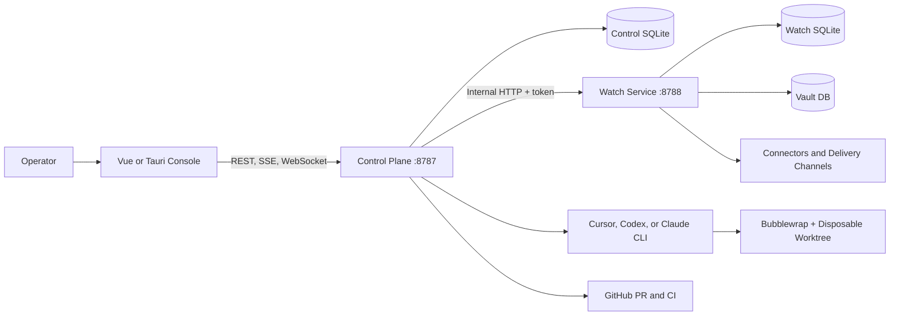
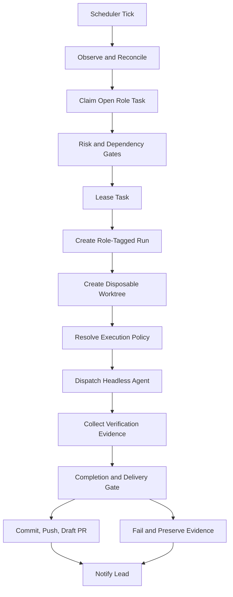

# AXON-X Platform Intelligence Audit

**Audit date:** 20 August 2026
**Scope:** current repository worktree, including uncommitted files
**Method:** static source/configuration review; no runtime or deployment assumptions
**Repository changes at audit time:** none (this document is the persisted deliverable)

## 1. Executive summary

AXON-X is a local-first, three-surface operator and coding platform:

1. A Vue/Tauri operator console presents workspaces, agents, runs, terminals, approvals, signals, and recovery controls.
2. A FastAPI control plane owns interactive decisions, run state, agent dispatch, planning, task leasing, verification, and UI-facing aggregation.
3. A separate FastAPI watch service owns monitoring, connector probes, signal assembly, notification delivery, vault operations, and tunnel supervision.

The intended ownership rule is clear:

> Watch detects and persists. Control plane decides and acts. UI presents and steers.

The implementation substantially follows this split. Its strongest architectural elements are explicit run-state persistence, task-bound worker execution, disposable Git worktrees, Bubblewrap isolation, layered tool authorization, receipt-backed verification, and CI guardrails.

The system is not yet a fully durable or distributed autonomous platform. Important queues and job registries remain process-local; SQLite is the single-host persistence strategy; live events are in-memory fan-out; and worker orchestration is a scheduler plus threads rather than a durable workflow engine.

The audited worktree also contained a substantial, uncommitted platform-recovery subsystem. Its backend is meaningful, but its UI, automatic self-healing, resume semantics, reconciliation, and Fast Gate coverage were incomplete at audit time. It must not be treated as production-proven solely because the routes and controls exist.

## 2. Evidence and source-of-truth hierarchy

For this audit, evidence was ranked as follows:

1. Executable implementation:
   - `services/control-plane/app`
   - `services/axon-watch/app`
   - `apps/console-web/src`
2. Runtime configuration:
   - `config`
   - `project.axon.yaml`
3. Executable contracts:
   - `packages/shared-types/src`
   - CI and verification scripts
4. Architecture and ADR documents
5. Operator guides, plans, and historical evidence reports

The documented source hierarchy is itself inconsistent:

- `README.md` and `docs/planning/README.md` identify `docs/planning/` as canonical.
- `docs/contracts/README.md` and parts of `docs/HOW-TO-HANDBOOK.md` still point to the old `axon-local` mirror.
- `docs/planning/ADR-004` and `docs/adr/ADR-004` describe different decisions. The same is true for ADR-005.
- Root `PRODUCT.md` and `ARCHITECTURE.md` duplicate the planning versions with branding differences.

Senior engineers should verify claims against code and executable contracts rather than relying on an ADR number alone.

## 3. Platform overview



### Console

`apps/console-web` is a Vue 3 operator shell containing:

- workspace navigation;
- Monaco editor and file surfaces;
- xterm-based terminals;
- agent composer and employee threads;
- task, run, approval, inbox, and runtime projections;
- KAIRO/VAXON voice and presence surfaces;
- the Recovery Center overlay (worktree-era).

The browser uses relative `/api` requests, allowing Vite or Caddy to route traffic to the control plane. It does not normally call the watch service directly.

`apps/console-desktop` wraps the console with Tauri. Desktop deployment, host sensors, pairing, and clean-install evidence are less mature than the web/control-plane path.

### Control plane

`services/control-plane/app/main.py` creates the public FastAPI application. Its major responsibilities include:

- operator and desktop authentication;
- run lifecycle and history;
- chat and agent runtime dispatch;
- task ledger and Lead planning;
- workspace files and terminals;
- approvals and step-up gates;
- runtime summaries and operator briefing;
- watch-service aggregation;
- verification and worker delivery;
- CI remediation and fleet repair;
- recovery projections and operational instructions.

Route registration is centralized in `services/control-plane/app/routes/__init__.py`.

### Watch service

`services/axon-watch/app/main.py` exposes internal `/internal/watch/*` routes for:

- connector and monitor probes;
- signal/inbox assembly;
- commands and events;
- notification delivery and receipts;
- vault setup, locking, secrets, import/export, and runtime environment;
- Sentry attendance;
- Cloudflare tunnel control.

A critical distinction: current signal inbox rows are largely assembled from probes on request. They are not all durable signal records. Durable watch storage primarily covers commands, events, delivery receipts, deduplication, and acknowledgements.

### Shared contracts

`packages/shared-types` defines UI-facing TypeScript contracts for:

- run modes, phases, statuses, and delivery stages;
- workspace agents and company rosters;
- runtime summaries and briefings;
- signals and inbox rows;
- workspace handoffs;
- cross-workspace missions.

These contracts are useful, but Python services do not import the TypeScript definitions. Alignment therefore depends on fixtures and verification rather than one shared runtime schema.

## 4. Deployment and persistence

### Supported topology

Documented modes are:

- local development via `scripts/dev/up.sh`;
- production-like local hosting with user systemd;
- dedicated hosting through Caddy and Docker Compose;
- a packaged Tauri desktop.

Default development ports are:

| Surface | Port |
|---|---:|
| Console | 4173 |
| Control plane | 8787 |
| Watch service | 8788 |

Dedicated startup order is storage → watch → control plane → console → reverse proxy, as defined in `config/deployment-topology.json`.

### Persistence

The platform is SQLite-centric:

- control-plane DB: runs, history, chat, tasks, handoffs, memories, host context, scheduler settings, and other operator state;
- watch DB: commands, events, delivery receipts, and acknowledgements;
- vault DB: encrypted secret storage;
- recovery sidecar DB: recovery records, checkpoints, circuit breakers, retry fingerprints, and lessons;
- some additional features maintain their own sidecar tables or databases.

This is suitable for the current single-host/local-first model. It is not an HA or horizontally scalable persistence architecture. There is no replication, distributed lease service, cross-instance event bus, or leader election.

## 5. Agent inventory

### Canonical roles

The role catalog defines:

| Role | Schedule | Responsibility |
|---|---|---|
| `lead` | on demand | Plans, delegates, synthesizes, escalates |
| `watcher` | always on | Signals, health, CI observation |
| `frontend` | continuous | UI and presentation implementation |
| `backend` | continuous | APIs, persistence, services |
| `integrations` | continuous | Connectors, CI, external wiring |
| `workspace_agent` | on demand | General fallback |
| `overview_agent` | on demand | Cross-workspace overview |

`overview_agent` exists in the catalog but is not represented by a named employee and is excluded from continuous scheduling.

### Configured companies

`config/workspace-agents.json` currently defines six companies:

| Workspace | Lead | Watcher | Frontend | Backend | Integrations |
|---|---|---|---|---|---|
| AXON-X | Mira | Rowan | Jules | Reed | Quinn |
| DashPro | Dana | Cass | Priya | Marco | Soren |
| EDP Excellence | Lindi | Thabo | Naledi | Sipho | Amara |
| TPS | Noor | Blair | Vera | Hugo | Tess |
| Young Eagles Day Care | Imani | Ash | Lila | Cole | Sol |
| Axon Local | Avery | Remy | Sable | Mina | Drew |

These are runtime roster definitions, not separate deployed agent services. Each employee becomes operational when a role-tagged run is dispatched through the control plane.

VAXON/KAIRO is an operator-presence and fleet-coordination concept layered above company Leads. It is not represented as another standard continuous employee role.

## 6. Agent lifecycle

The system has several related but distinct state models.

### Run state: authoritative execution truth

The canonical persisted phases are:

```text
queued
  → starting
  → planning
  → awaiting_input | awaiting_approval | executing
  → waiting_external | paused | review_ready
  → completed | failed | cancelled
```

Legal transitions are enforced by `domain/run_transitions.py`, not inferred from prompt text.

### Task state

Continuous work is represented by a task ledger:

```text
open → leased → completed | failed | cancelled
```

Tasks contain:

- goal and acceptance criteria;
- owner role;
- risk;
- dependencies;
- exclusive and allowed paths;
- lease holder and expiry;
- attempt budget and attempts used;
- associated run and terminal outcome.

### Roster state

Employee UI statuses such as `planning`, `executing`, `verifying`, and `blocked` are projections from run records. They are not separate execution truth.

### Recovery state

The recovery subsystem projects runs into:

- `ACTIVE`
- `STALE`
- `ORPHANED`
- `RESUMABLE`
- `RETRYABLE`
- `FAILED`
- `BLOCKED`
- `HUMAN_REVIEW`

These are diagnostic buckets layered over run/task/checkpoint state. They do not replace the canonical run lifecycle.

### Scheduled worker lifecycle



The implementation defaults to one new start per tick and two active executing employee runs. Older documentation stating six starts and 24 active runs is stale.

## 7. Context flow

### Operator composer context

A Lane B request can include:

- workspace and project root;
- composer mode and execution tier;
- active file and selection;
- terminal snippets;
- attached images;
- recent thread history;
- operator memory;
- KAIRO session context;
- runtime, briefing, roster, and watcher summaries;
- employee persona when the thread belongs to a named employee.

The current operator request remains primary. Recent thread context is explicitly marked non-authoritative and capped.

### Worker context

Continuous workers receive a more rigid packet:

1. named employee identity;
2. workspace and role ownership;
3. leased task ID;
4. task goal and acceptance criteria;
5. allowed and expected paths;
6. verification requirements;
7. relevant prior run receipts;
8. team roster;
9. role-specific operational guidance;
10. delivery and escalation rules.

The prompt explicitly states that the task packet overrides stale thread context, previous runs, and tab titles.

### Context precedence

The effective precedence is:

```text
Security and execution policy
  > leased task packet
  > current operator request
  > role/persona boundary
  > verified receipts and current runtime state
  > recent thread and prior-shift context
  > general planning/documentation
```

This ordering is sensible but distributed across prompt builders rather than represented as a single formal context contract.

## 8. Prompt architecture

Prompts are assembled in Python rather than stored as one prompt file.

Principal layers include:

- mode-specific system prompt in `cli_runtime/router.py`;
- agent prompt assembly in `cli_runtime/router_prompt.py`;
- plan-mode behavior in `cli_runtime/plan_system_prompt.py`;
- continuous worker prompt in `workspace_agents/worker_prompt.py`;
- employee persona in `employee_persona_prompt.py`;
- write rules in `agent_write_contract.py`;
- standing accuracy and critical-review clauses;
- role-specific backend, watcher, CI, and delivery clauses;
- roster and fleet ownership context.

Strengths:

- explicit authority and scope;
- strong anti-hallucination language;
- clear reporting hierarchy;
- current task packet wins over stale context;
- prompt behavior is testable Python.

Weaknesses:

- very large, concatenated prose prompts;
- operational incidents have accumulated as embedded special cases;
- duplicated policy between prompts, docs, runtime checks, and Cursor rules;
- planned `packages/prompt-contracts` does not exist;
- `AGENTS.md` is referenced as a potential source but is absent;
- prompt correctness depends on string markers and textual receipt conventions.

## 9. Tool permissions and trust boundaries

Agent authority is enforced in layers.

### Role and task policy

Role defaults define:

- readable and writable paths;
- forbidden globs;
- approved wrappers and command prefixes;
- network mode;
- execution access;
- audited capabilities.

The effective policy intersects role policy, employee override, project contract, and task paths.

### Filesystem isolation

Continuous workers execute in disposable Git worktrees. Bubblewrap then:

- exposes the checkout read-only by default;
- bind-mounts only approved writable roots;
- hides forbidden paths;
- masks repository configuration and credentials;
- provides a private home and scratch directories;
- drops capabilities and separates process namespaces.

Supplying a sandbox policy cannot silently fall back to unsandboxed execution.

### Shell policy

The shell hook denies:

- interpreter escapes such as `python -c`, `node -e`, or `bash -c`;
- destructive Git operations;
- unapproved network commands;
- commands outside approved prefixes.

### Terminal jobs

Agent-owned terminal jobs require:

- a trusted run ID;
- matching source and target workspace;
- an employee role;
- a scoped task, except narrow shipping exceptions;
- a command accepted by the resolved execution policy.

PTY writes are serialized per session in the recovery-era worktree code.

### HTTP authorization

The control plane globally protects mutating routes and selected sensitive GET routes using operator bearer tokens, desktop sessions, or an optional local loopback bypass.

The watch service separately protects mutating and confidential routes with an internal token and optional proxy-verified mTLS.

Important risks:

- auth mode can remain off locally;
- remote enforcement depends on correctly declaring reachability;
- binding to a non-loopback interface without setting the corresponding reachability configuration can leave an unsafe posture, although startup now logs a warning;
- recovery and platform-doctor GET routes are not included in the sensitive-GET list and may disclose operational metadata on a remotely reachable deployment.

## 10. Memory model

The platform has multiple memory classes.

### Durable operational memory

- run records and transition receipts;
- task ledger and leases;
- chat threads and messages;
- Lead plans and plan receipts;
- workspace handoffs and missions;
- worker delivery records;
- checkpoints and recovery records;
- operator notes, reminders, and open loops;
- autonomous-attention decisions;
- CI remediation and fleet repair records.

### Conversation memory

KAIRO session memory stores turns and extracted entities in SQLite, capped at 16 KiB per session. Old turns are evicted first.

Recent workspace dialogue is included in context as a small capped transcript. It is contextual, not authoritative.

### Ephemeral memory

The following are process-local:

- live-event subscriber queues;
- chat stream queues;
- worker-dispatch claims;
- terminal job registry;
- PTY session queue;
- some participant/guest voice memory.

Process-local memory is the major durability fault line. In particular, Gate 6 verification can depend on terminal job records that disappear across a control-plane restart.

## 11. Planning pipeline

There are two principal planning paths.

### Operator Plan mode

Plan mode:

1. assembles workspace and thread context;
2. asks the headless agent for a complete Markdown plan;
3. does not rely on interactive Cursor plan tools;
4. persists the reply as the durable plan artifact;
5. marks the related run `review_ready`.

This is primarily an operator-facing plan artifact, not automatic task decomposition.

### Lead planner

Lead planning can:

1. preview a goal as an ordered task graph;
2. assign specialist roles;
3. calculate dependencies;
4. prevent overlapping exclusive paths;
5. materialize tasks and queued runs;
6. fan work out in parallel;
7. replan and cancel obsolete tasks;
8. synthesize specialist outcomes.

Lead fan-out is real ledger activity, not merely a prose handoff. Cross-company work should use workspace handoff APIs rather than silently editing a foreign project.

Planning remains partly heuristic. There is no general-purpose durable DAG executor; dependencies and tasks are persisted, but progression is driven by scheduler ticks and specialized orchestration functions.

## 12. Execution pipeline

### Operator-driven Lane B

The standard path is:

```text
POST chat message
  → classify route
  → resolve or create run
  → assemble context and system prompt
  → dispatch selected CLI runtime
  → stream deltas and milestones
  → validate reply
  → transition run
  → persist chat and receipts
```

Operator IDE runs are intentionally not auto-bound to queued verification tasks.

### Continuous worker execution

Worker execution adds:

- mandatory leased task;
- per-role active-run deduplication;
- disposable worktree creation;
- Bubblewrap and hook policy;
- heartbeat and meaningful-progress checkpoints;
- IDE-thread mirroring;
- acceptance and delivery gates;
- automatic Lead notification;
- worktree cleanup or preservation on failure.

Supported runtime families include Cursor, Codex, and Claude CLI integrations. The exact selected provider depends on runtime catalog, preferences, authentication, availability, and fallback logic.

## 13. Verification pipeline

Verification has two distinct paths.

### Contract-driven Gate 6

Normal task-bound worker runs use the project contract to determine required checks:

- lint;
- typecheck;
- tests;
- build;
- security;
- diff budget.

The verifier:

1. resolves changed paths;
2. strips control-plane-owned scaffolding;
3. intersects task and project path authority;
4. scans changed text for policy findings;
5. runs required checks;
6. records `acceptance_evidence`;
7. blocks review-ready/completion without a passing receipt.

Frontend-heavy checks may be skipped when no console-web files changed.

### Dedicated verification tasks

A task beginning with “Verification after…” follows a terminal-receipt path:

1. approved commands are extracted from goal/acceptance text;
2. commands are normalized and validated;
3. terminal jobs are enqueued;
4. exit status and output become evidence;
5. the run only passes when the required job count succeeds.

### Completion and publication

The completion gate additionally checks:

- whether implementation was requested;
- whether changed files exist and are non-empty;
- whether the worker reported those files;
- whether paths plausibly match the objective;
- whether validation evidence exists;
- whether code-changing delivery produced a commit SHA.

This is stronger than relying on an agent’s narrative, but some checks remain heuristic, particularly objective-to-path token overlap and textual edit-receipt parsing.

## 14. Git workflow

### Intended workflow

```text
feature or worker branch
  → local verification
  → focused commit
  → push
  → draft PR to dev
  → Fast Gate
  → human-controlled merge
```

`dev` is the current integration branch. `master` is a legacy baseline.

### Worker delivery

Workers do not directly run unrestricted `git add`, commit, push, or merge. The delivery service:

- inspects changed paths;
- enforces scope and secret policy;
- stages approved files;
- creates a `worker/<run_id>` branch and commit;
- pushes and opens a draft PR according to workspace delivery configuration;
- records commit, PR, and CI references.

Protected merges, force-pushes, secrets, and production actions remain human-gated.

### CI

Fast Gate runs on every push and pull request:

1. shared contracts, file budgets, and backend contract tests;
2. critical-hotspot change checks;
3. console typecheck, Vitest, and build;
4. dependency, DTO, ADR, latency, and strict-pending checks.

Nightly verification starts the full stack, captures live evidence, performs strict verification, uploads artifacts, and shuts the stack down.

Local preflight is only guaranteed when using `scripts/sc`. There is no repository-managed pre-commit hook, so plain `git commit` can bypass it.

Documented GitHub branch protection is externally enforced and could not be verified from repository contents.

## 15. Communication patterns

### Operator-facing

- REST for state snapshots and commands;
- SSE `/api/live/events` for runtime and material-change refresh;
- per-thread SSE for chat streaming;
- WebSocket for interactive terminal sessions;
- OS notifications and spoken-line events as best-effort channels.

### Inter-service

The control plane communicates with watch over HTTP using an internal token. The UI does not need direct watch authority.

Watch events are durable in SQLite and exposed via polling-backed SSE. Control-plane live events are in-memory queues and therefore single-process.

### Agent-to-agent

- specialist → company Lead through task/run receipts and IDE thread messages;
- Lead → VAXON/operator through synthesized reports;
- Lead → specialists through task creation and fan-out;
- cross-company Lead handoff through workspace handoff records and target tasks;
- tool denial can produce a scoped task for the correct role;
- verification and delivery outcomes become durable run receipts.

This is a receipt-oriented communication architecture rather than a direct peer messaging fabric.

## 16. Recovery pipeline

The audited worktree added:

- stale-signal diagnosis;
- failure classification;
- retry fingerprints;
- checkpoints;
- recovery records;
- circuit breakers;
- recovery lessons;
- doctor and reconcile commands;
- Recovery Center UI;
- restart preservation for checkpointed employee runs.

Checkpointed executing runs can be paused and projected as `RESUMABLE` during control-plane restart. Uncheckpointed work follows the older cancellation/reopen path.

However:

- the resume endpoint changes run state but does not itself demonstrate that a worker process is redispatched;
- autonomy helpers for automatic reconcile/retry are largely unused;
- the documented self-heal ladder is therefore mostly policy vocabulary, not complete automation;
- worktree reconciliation currently inventories no worktrees and only removes stale PID files;
- Recovery Center advertises many actions, but the UI only implements Resume, Acknowledge, and dry-run Reconcile;
- Retry, Cancel, Inspect, Approve, logs, evidence, and worktree buttons currently perform no corresponding action;
- the subsystem was uncommitted at audit time and its key tests were not in Fast Gate.

## 17. Strengths

1. Clear three-surface ownership boundary.
2. Explicit, persisted run lifecycle rather than prompt-inferred execution state.
3. Durable task leasing with dependencies and attempt budgets.
4. Real disposable Git worktrees for worker isolation.
5. Fail-closed Bubblewrap boundary with role/task-scoped writes.
6. Layered command authorization and terminal identity checks.
7. Receipt-backed acceptance and completion gates.
8. Human approval retained for irreversible or authority-expanding actions.
9. Strong CI ratchets for file size, hotspots, contracts, and console correctness.
10. Substantial automated tests and CI-contract tests.
11. Explicit separation between observed heartbeats and meaningful progress.
12. Good startup reconciliation for stale and orphaned run state.
13. Configuration-driven companies and cross-workspace ownership.
14. Draft-PR delivery rather than direct autonomous protected-branch mutation.

## 18. Weaknesses

1. Orchestration is process/thread based rather than durably scheduled.
2. Terminal jobs, stream subscribers, dispatch claims, and queues are in memory.
3. SQLite and in-process SSE constrain multi-instance operation.
4. Prompt assembly is large, duplicated, and incident-driven.
5. UI/runtime schemas are duplicated across TypeScript and Python.
6. Documentation has competing canonical locations and duplicate ADR numbers.
7. Auth safety depends on correct deployment metadata.
8. Watch signal durability is narrower than high-level architecture language suggests.
9. Recovery UI overstates implemented actions.
10. Recovery and fleet self-heal overlap conceptually.
11. Many verification scripts are outside required CI.
12. Desktop and dedicated-host proof is weaker than the web/control-plane path.
13. Some project-contract health probes use `/healthz`, while implemented routes use `/api/health` and `/internal/watch/health`.
14. Local commit preflight is opt-in.
15. Large hotspot budgets, notably the shell store, preserve substantial structural debt.

## 19. Technical debt

### High priority

- Uncommitted platform recovery spans backend, frontend, auth, terminal, and operations without Fast Gate coverage.
- Terminal job state must become durable if verification depends on it.
- Recovery Center action projection and actual handlers must agree.
- Recovery GET data needs an explicit remote authorization policy.
- Resume must reconnect execution, not only transition the run record.
- Self-heal levels must either control behavior or be relabeled as planned capability.

### Structural

- Consolidate the two ADR namespaces or assign globally unique IDs.
- Remove stale `axon-local` canonical pointers.
- Reconcile root and extended project contracts.
- Create one formal prompt/context contract.
- Reduce giant frontend stores and other ratcheted hotspots.
- Clarify boundaries between `fleet_self_heal` and `platform_recovery`.
- Remove generated `*.egg-info` artifacts from the worktree and ensure they remain ignored.

## 20. Architectural risks

| Risk | Severity | Reason |
|---|---|---|
| False recovery confidence | Critical | UI displays actions and resumability not fully wired to execution |
| Verification loss on restart | High | Terminal job evidence is process-local |
| Remote metadata exposure | High | Recovery/doctor GET routes are outside sensitive GET protection |
| Incorrect auth posture | High | Reachability can be misdeclared while auth remains off |
| Split source of truth | High | Code, planning, handbook, duplicate ADRs, and contracts disagree |
| Process-local orchestration | High | Restart or multi-instance operation can duplicate or lose work |
| Recovery subsystem regression | High | New tests are outside Fast Gate |
| Single-host scaling ceiling | Medium | SQLite and in-memory SSE lack distributed coordination |
| Prompt-policy drift | Medium | Rules duplicated across prompts, hooks, docs, and config |
| Signal continuity ambiguity | Medium | Inbox signals are often recomputed rather than durably event-sourced |
| Worktree accumulation | Medium | Reconcile currently has no real worktree inventory |
| External branch policy drift | Medium | Branch protection exists outside version-controlled configuration |

## 21. Opportunities for improvement

### P0: Make current recovery work trustworthy

1. Put recovery, sensitive-GET, terminal-queue, and Gate 6 regression tests into Fast Gate.
2. Hide unsupported Recovery Center actions or implement matching APIs.
3. Require authentication for recovery and doctor data on remote deployments.
4. Add a tested resume coordinator that reacquires execution and proves one active worker.
5. Implement real worktree inventory with dirty-tree preservation.
6. Make self-heal levels govern actual scheduler behavior or downgrade the documentation.

### P1: Improve durability and consistency

1. Persist terminal jobs and dispatch claims.
2. Add idempotent queue ownership and restart-safe worker resumption.
3. Consolidate recovery and fleet-self-heal projections.
4. Introduce a generated API/schema layer shared by Python and TypeScript.
5. Make project contracts the sole verification and health-probe source.
6. Add a repository-managed optional pre-commit setup.
7. Add nightly/weekly CI tiers for high-value parity suites.

### P2: Prepare for multi-host operation

1. Replace in-process SSE fan-out with a durable pub/sub abstraction.
2. Introduce a workflow engine or durable orchestration table with leases and idempotency.
3. Decouple persistence adapters from direct SQLite assumptions.
4. Add structured metrics, traces, and long-term health history.
5. Define explicit single-writer or leader-election semantics.
6. Make deployment topology and branch protection verifiable infrastructure.

### P3: Reduce cognitive load

1. Create one canonical architecture index.
2. Rename planning ADRs or implementation ADRs to avoid collisions.
3. Generate prompt documentation from runtime builders.
4. Extract special-case incident guidance from core prompts into versioned policy modules.
5. Add an onboarding route that distinguishes local development, always-on systemd, and dedicated hosting.

## 22. Explicit unknowns

The repository does not prove:

- which deployment mode is currently serving any public AXON-X hostname;
- whether mTLS is enabled on a real host;
- whether `dev` branch protection remains configured exactly as documented;
- whether child-workspace paths and credentials are valid on this machine;
- whether all configured continuous schedules are currently enabled;
- whether the current uncommitted recovery code has passed the complete clean-baseline suite;
- whether a resumed checkpointed run successfully reattaches a live worker;
- whether any production deployment runs multiple control-plane instances;
- whether external delivery channels are currently configured and healthy;
- whether the uncommitted service-connection configuration contains valid or safe values.

These should not be inferred from configuration shape alone.

## 23. Senior-engineer onboarding path

Recommended reading order:

1. `README.md`
2. `docs/planning/ARCHITECTURE.md`
3. `docs/planning/run-state.md`
4. `services/control-plane/app/routes/__init__.py`
5. `services/control-plane/app/runs`
6. `services/control-plane/app/workspace_agents`
7. `services/control-plane/app/chat`
8. `services/control-plane/app/cli_runtime`
9. `services/axon-watch/app/main.py`
10. `packages/shared-types/src`
11. `project.axon.yaml`
12. `.github/workflows/fast-gate.yml`
13. `docs/how-to/platform-recovery.md`, followed immediately by the implementation to distinguish shipped behavior from intent.

## 24. Overall assessment

AXON-X is beyond a prototype: it has real agent execution, task leasing, isolation, verification, Git delivery, CI remediation, and operator-facing orchestration.

Its present architecture is best described as a strong single-host autonomous-workbench foundation, not yet a durable distributed agent platform. The next engineering priority should be to make recovery and verification survive process failure with the same rigor already applied to run history, task leasing, Git isolation, and CI receipts.
