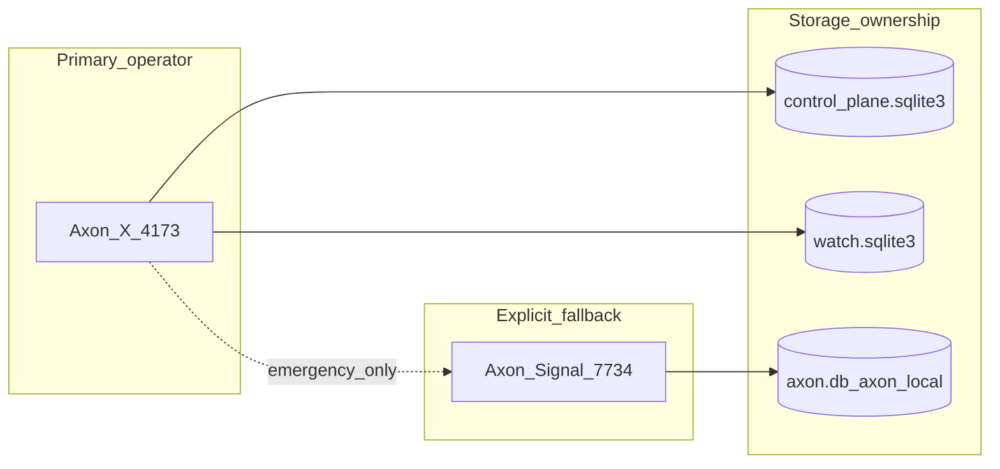

# Phase G6 — Retirement Readiness (axon-local → Axon-X)

**Opened:** 2026-07-07  
**Primary URL after retirement:** http://127.0.0.1:4173  
**Fallback until sign-off:** http://127.0.0.1:7734 (explicit only)

## Purpose

Reassess `config/parity-snapshot.json` → `blockers_for_full_retirement` with G1–G5 evidence, define a one-week `:4173`-only dry-run, and rollback criteria to `:7734`.

**G6.4:** `scripts/verify/test17-full-retirement-readiness.sh` — `npm run verify:retirement-readiness`. PASS triggers operator review only; does not auto-retire axon-local.

**Headed browser smoke:** `npm run verify:headed-browser-smoke` — run daily during G6.2 dry-run. Set `AXON_HEADED=1` for a visible browser window.

---

## G6.1 — Blocker reassessment (evidence table)

| Blocker ID (inventory) | G1–G5 evidence | Current status | Retire `:7734` for this? |
|------------------------|----------------|----------------|--------------------------|
| `agent_orchestration` | G3 green, `verify:agent-orchestration-parity` | **Replaced** | Yes — agent file edits on Axon-X |
| `cloudflare_tunnel` | G4.3 green; start/stop via axon-local script when `AXON_LOCAL_ROOT` set | **Partial** | No — keep fallback until native start/stop |
| `voice_deck_mobile_cockpit` | G4.4 green; foreground-only v1 | **Partial** | Operator choice — accept v1 or keep `:7734` voice |
| `agent_dock_legacy_parity` | G4.5 green | **Closed** | Yes |
| `whatsapp_web_monitor` | G4.2 **deferred** | **Unmigrated** | No — DashPro WhatsApp on `:7734` |
| `legacy_settings_storage` | G5.1 matrix maps keys; many on Axon-X operator-presence | **Partial** | No — until matrix shows no silent merges |
| `dashpro_external_monitors` | `verify:dashpro-monitors` | **Partial** | No — tied to child-project ops |
| `axon_local` (fallback surface) | Entire stack | **Required today** | No — until G6.2 + sign-off |

**Updated `blockers_for_full_retirement` (candidate text for G5.3 snapshot refresh):**

1. WhatsApp Web monitor unmigrated (G4.2 deferred)
2. Legacy settings paths without Axon-X owner (G5.1 partial rows)
3. Tunnel start/stop dependency on axon-local script (G4.3 partial)
4. Operator has not completed one-week `:4173`-only dry-run (G6.2)

---

## G6.2 — One-week `:4173`-only dry-run checklist

**Goal:** Prove daily operator work without opening `:7734` except documented emergency rollback.

### Daily startup (every day)

- [ ] `./scripts/dev/up.sh --no-open` in `axon-watch`
- [ ] Open http://127.0.0.1:4173 only — do **not** open `:7734` unless rollback triggered
- [ ] `./scripts/dev/check-health.sh` green

### Workspaces to exercise (rotate across the week)

| Day focus | Workspace | Tasks |
|-----------|-----------|-------|
| Mon | `workspace_smoke` | TEST-0 path: operator command, run stop, Attention |
| Tue | `workspace_axon_watch` | IDE agent turn, file edit, save, terminal |
| Wed | `workspace_axon_local` (bound project) | Real repo git status, handoff if needed |
| Thu | DashPro child workspace | Monitors, connectors rail, tunnel status |
| Fri | Mixed | Full Access agent run, voice cockpit (if used), mobile compact viewport |

### Daily verification (automated)

- [ ] `npm run verify:headed-browser-smoke` (Playwright shell + operator/IDE mode; screenshots under `.local/verify/headed-smoke/`)
- [ ] `npm run verify:connector-parity` (or full `verify:signal-parity-matrix` weekly)
- [ ] Note any forced `:7734` fallback with reason in append log

### End-of-week criteria

- [ ] Zero unplanned `:7734` sessions OR each session logged with blocker ID
- [ ] No data corruption in control-plane SQLite (runs, chat, vault)
- [ ] Operator confirms KAIRO/briefing rhythm acceptable on `:4173`
- [ ] Sign `PHASE_G5_INTENTIONAL_DISCARDS.md` acknowledgment boxes

---

## G6.3 — Rollback criteria to `:7734`

**Immediate rollback** (stop dry-run, resume Signal as primary):

| Trigger | Action |
|---------|--------|
| Agent run loses file edits or corrupts workspace | Rollback; file bug in G3/cli_runtime |
| Vault unlock failure blocks all LLM runs | Rollback; G1/G2 regression |
| Silent wrong run phase (stop doesn't stop) | Rollback; run-state truth bug |
| Child-project incident (DashPro) due to missing connector | Rollback for that project; log inventory ID |
| Operator judgment: `:4173` slower or less trustworthy than `:7734` | Rollback; reprioritize slice |

**Rollback procedure:**

1. `./scripts/dev/down.sh` (Axon-X optional — can leave running)
2. `cd axon-local && ./start.sh` → http://127.0.0.1:7734
3. Log incident in `docs/PHASE_G_EXECUTION_TRACK.md` with blocker ID + commit hash
4. Do **not** set `full_axon_local_retirement: true` in parity snapshot

**Soft rollback:** Keep `:4173` running but use `:7734` for specific connector (WhatsApp) until G4.2 or discard ack.

---

## G6.4 — `test17-full-retirement-readiness.sh` (implemented)

**npm script:** `"verify:retirement-readiness": "./scripts/verify/test17-full-retirement-readiness.sh"`

**Preconditions (all must pass before TEST-17 PASS):**

- `verify:signal-parity-matrix` green
- `PHASE_G5_INTENTIONAL_DISCARDS.md` operator ack complete
- G6.2 dry-run log has at least one checked item

**Exit:** TEST-17 PASS does **not** auto-retire axon-local — triggers operator review only.

---

## Coexistence model (until sign-off)

---

## References

- `docs/PHASE_G5_CAPABILITY_MATRIX.md`
- `config/parity-snapshot.json`
- `config/legacy-connector-inventory.json`
- `docs/CUTOVER_DECISION.md`
- `docs/BROWSER_ONLY_STARTUP_CONTRACT.md`
