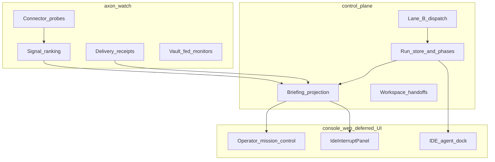

# KAIRO Brain–UI Architecture (Planning — UI Deferred)

**Opened:** 2026-07-07  
**Status:** Planning only — no `apps/console-web/**` implementation in this pass  
**Reference pack:** `/home/edp/Downloads/JARVIS-Prompt-Pack.pdf` (6 prompts — concepts only, not ports)

## Purpose

Map JARVIS prompt-pack ideas to **Axon-shaped** services and define what Operator vs IDE modes should subscribe to — without building new UI in this planning handoff.

**KAIRO ≠ JARVIS skeleton:** Axon adopts loop + personality + prove-source + server-side brain. Axon **rejects** 3D note galaxy and markdown keyword RAG as system truth.

---

## Operator vs IDE (same three services)

```text
axon-watch (:8788)     — detect, persist, connectors, signals, delivery
control-plane (:8787)  — decide, runs, approvals, dispatch, briefing
console-web (:4173)    — present, steer (layout toggle only)
```

Layout toggle changes **psychology and subscriptions**, not processes.

| Mode | Operator mental model | Primary subscriptions | Interrupt tier |
|------|----------------------|----------------------|----------------|
| **Operator** | Command deck / second brain | `/api/briefing`, `/api/inbox`, `/api/live/events` (full refresh), `/api/runs`, Attention sidebar | KAIRO sidebar, spoken alerts, mission control STOP |
| **IDE** | Executor / quiet until interrupt | Workspace files, lane B agent stream, **interrupt-only** briefing/inbox | `IdeInterruptPanel`: approvals, critical signals, degraded runtime |

See ADR-008: IDE Agent dock = Lane B CLI; Operator right dock = command thread + hero.

---

## Data subscription matrix (planning contract)

| DTO / stream | Operator mode | IDE mode | Owner service |
|--------------|---------------|----------|---------------|
| `/api/briefing` | Poll + SSE-triggered refresh (~5–10s when visible) | **Interrupt-only** fetch when `IdeInterruptPanel` tier ≥ assist | control-plane |
| `/api/inbox` | Via briefing + Attention | Critical severity only in interrupt panel | control-plane ← watch |
| `/api/live/events` SSE | `runtime_refresh` + `presence_refresh` heartbeats | Same connection; IDE skips non-critical refresh handlers | control-plane |
| `/api/runs/{id}/history` | Mission control + logs | Agent dock receipts (future DTO panel) | control-plane |
| `/api/runtime/summary` | Topbar + status bar | Quiet chip; hide when healthy (UX-IDE-1) | control-plane |
| Watch connector probes | Connectors rail + KAIRO | Degraded-only in interrupt | axon-watch |
| Vault posture | Composer unlock CTA | Same when keys missing | axon-watch vault + CP |

**Planning rule:** IDE must not run Operator-grade polling for briefing when tab is healthy and quiet — see `OPERATOR_REFRESH_POLICY.md`.

---

## JARVIS pack → Axon mapping

| JARVIS pack prompt (6) | Axon adoption | Axon-shaped equivalent | Service owner | UI status |
|------------------------|---------------|------------------------|---------------|-----------|
| **Galaxy** (3D note space) | **Reject as system truth** | Operator mission control + Attention list; optional future **doc graph DTO** (not spatial UI) | control-plane briefing | **Deferred** `BRAIN-UI-1` |
| **Note-RAG brain** (markdown keyword search) | **Reject as orchestration truth** | `/api/briefing` + run history + signal store; explicit search API later | control-plane + watch SQLite | **Deferred** `BRAIN-UI-2` |
| **Voice** (hands-free loop) | **Adapt** | `features/voice-deck/`, `kairo_ask_prompt.py`, browser TTS v1 | console-web + CP | **Done** G4.4; cloud TTS deferred |
| **Fly-to-source** (jump to evidence) | **Adapt as prove-source** | Research cards (`:::research`), `@file:` / `@selection` tokens, run history receipts | lane B + console-web | **Partial** UX-IDE-3/4 done |
| **Personality** (JARVIS tone) | **Adapt** | KAIRO persona settings (`operator_persona_enabled`), Ask mode prompt | `kairo_persona.py` | **Done** parity-c1 |
| **Remember** (persistent memory) | **Adapt** | `run_history`, signal/delivery receipts, chat threads — **not** ad hoc prompt memory | CP + watch persistence | **Partial** — no operator memory CRUD on Axon-X yet |

---

## Server-side brain (control-plane + watch)



**Brain inputs:** watch signals, connector health, run phases, delivery receipts, vault posture.  
**Brain outputs:** briefing DTO, inbox ranking, executive rhythm, KAIRO watch rules — **not** raw SQLite rows.

---

## Future slices (planning IDs — no UI now)

| Slice ID | Description | Mode | Backend prerequisite |
|----------|-------------|------|----------------------|
| `BRAIN-UI-1` | Doc graph / handoff timeline in Operator center (DTO, not 3D) | Operator | Handoffs + run history APIs |
| `BRAIN-UI-2` | Contracted search over signals + runs (not markdown RAG) | Operator | Watch signal persistence stable |
| `BRAIN-UI-3` | Operator-only SSE channel (subset of live events) | Operator | Event taxonomy in `live_events.py` |
| `BRAIN-UI-4` | Handoff DTO operator → IDE (“continue in editor”) | Both | `workspace_handoffs` UI projection |
| `BRAIN-UI-5` | Voice capture → workspace command (hands-free) | Operator | `kairo_voice.py` stable (do not touch dirty files) |
| `BRAIN-UI-6` | Delivery receipts list in Attention (not grid) | Operator | `/api/delivery/receipts` |
| `BRAIN-UI-7` | Run history receipt tab in bottom panel | IDE | `/api/runs/{id}/history` |

---

## UI deferral register (Phase G planning handoff)

**All items below are explicitly out of scope** for the implementation agent until a future UX wave opens.

| ID | Deferred work | Reason |
|----|---------------|--------|
| `UX-DEF-LAYOUT` | Galaxy/JARVIS visual, CSS tokens, layout polish | Operator requested deferral |
| `UX-DEF-MOBILE` | Native mobile shell, background listening UI | Foreground v1 ceiling |
| `UX-DEF-SCREEN` | Headed screenshots, Playwright visual proof in CI | G4 proof local-only |
| `UX-DEF-VAULT-UI` | Vault deck polish beyond parity gate | Backend-first G5 |
| `UX-DEF-SETTINGS` | Full axon-local settings parity screens | G5 legacy_settings_storage |
| `UX-DEF-WHATSAPP` | WhatsApp monitor UI on Axon-X | G4.2 deferred |
| `UX-DEF-ELECTRON` | Desktop shell | BROWSER_ONLY contract |
| `UX-DEF-DB-UI` | Supabase-style table browser | IMPORT_MATRIX discard |
| `UX-DEF-GALAXY` | 3D note galaxy from JARVIS pack | Not Axon-shaped |

**Allowed without opening UX wave:** one-line contract notes in backend docs referencing DTO field names consumed by future UI.

---

## JARVIS pack review summary (1 paragraph)

The JARVIS Prompt Pack describes a cinematic operator fantasy: spatial note galaxy, local markdown brain, always-on voice, jump-to-source magic, fixed personality, and lightweight remember. Axon-X **already carries** the useful bones — KAIRO loop (watch → notice → advise → approve → execute → verify), persona-controlled Ask mode, event-driven voice cockpit (G4.4), research/prove-source cards and context tokens (UX-IDE-3/4), and SQLite-backed remember via runs, chat, signals, and receipts. Axon **explicitly does not port** the galaxy UI or keyword RAG as authority; those become server-side briefing and future contracted search. IDE mode stays quiet until `IdeInterruptPanel` escalates — matching executor psychology, not a second JARVIS HUD.

---

## References

- `docs/planning/KAIRO_MODE.md`
- `docs/planning/ADR-003-watch-control-boundary.md`
- `docs/adr/ADR-008-ide-shell-content-lock.md`
- `docs/planning/OPERATOR_REFRESH_POLICY.md`
- `docs/PHASE_G5_CAPABILITY_MATRIX.md`
